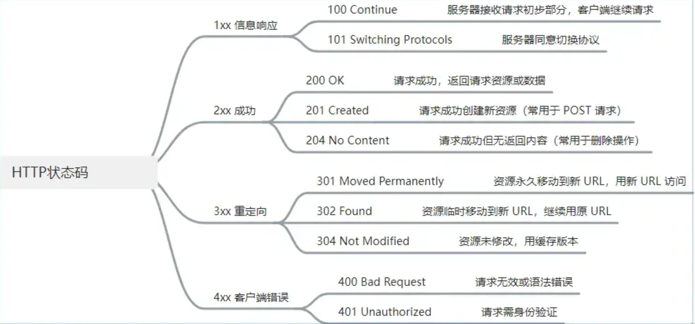

## 1. 常用网络状态码



## 2. 优化首屏时间

- 1 加载优化
  - 路由懒加载:使用 import() 实现组件按需加载，避免一次性加载全部路由组件。
  - 资源预加载:使用 preload、prefetch 等标签预加载关键资源。
  - 合理使用服务端渲染(SSR):对首屏内容进行服务端渲染,加快首屏内容展示。
- 2 资源优化
  - 码分割: 将代码按照特定规则分割成多个 chunk，实现按需加载。
  - 态资源压缩:对 JS、CSS 文件进行压缩，使用 gzip 或 brotli 压缩传输
  - 图片优化:使用 webp 格式，实现懒加载，合理设置图片尺寸。
- 3 缓存优化
  - 览器缓存:合理设置 HTTP 缓存策略，包括强缓存和协商缓存.
  - 本地存储:使用 localStorage 存储静态资源，减少请求次数。
- 4 代码优化
  - 避免重复渲染:合理使用 React.memo、useMemo、useCallback 等
  - 减少主线程阻塞:将大计算量的操作放到 Web Worker 中执行。

具体方案

```js showLineNumbers title="路由懒加载"
const Home = lazy(() => import('./pages/Home'))
const About = lazy(() => import('./pages/About'))

function App() {
  return (
    <Suspense fallback={<Loading />}>
      <Switch>
        <Route path="/home" component={Home} />
        <Route path="/about" component={About} />
      </Switch>
    </Suspense>
  )
}
```

```js showLineNumbers title="测试代码"
module.exports = {
  optimization: {
    splitChunks: {
      chunks: 'all',
      minSize: 20000,
      minChunks: 1,
      maxAsyncRequests: 30,
      maxInitialRequests: 30
    }
  }
}
```

```js showLineNumbers title="测试代码"
window.addEventListener('load', () => {
  const timing = performance.timing
  const firstPaint = timing.domContentLoadedEventEnd - timing.navigationStart
  console.log('首屏时间：', firstPaint)
})
```

## 装饰器

### 类装饰器

```ts showLineNumbers title="测试代码"
@logClass
class Person {
  constructor(name) {
    this.name = name
  }
}

function logClass(target) {
  // target: Person
  console.log('类装饰器:', target.name)
  return target
}
```

### 方法装饰器

```ts showLineNumbers title="测试代码"
function logMethod(target, name, descriptor) {
  // target: Person.prototype, name: sayHello, descriptor: {value: function, writable: true, enumerable: false, configurable: true}
  const originalMethod = descriptor.value
  descriptor.value = function (...args) {
    console.log(`调用方法: ${name}, 参数: ${args}`)
    return originalMethod.apply(this, args)
  }
  return descriptor
}

class Person {
  @logMethod
  sayHello(name) {
    console.log(`Hello, ${name}!`)
  }
}
```

### 属性装饰器

```ts showLineNumbers title="测试代码"
function logProperty(target, name) {
  // target: Person.prototype, name: name
  let value = target[name]
  Object.defineProperty(target, name, {
    get() {
      console.log(`获取属性: ${name}, 值: ${value}`)
      return value
    },
    set(newValue) {
      console.log(`设置属性: ${name}, 值: ${newValue}`)
      value = newValue
    }
  })
}
class Person {
  @logProperty
  name = 'John'
}
```
