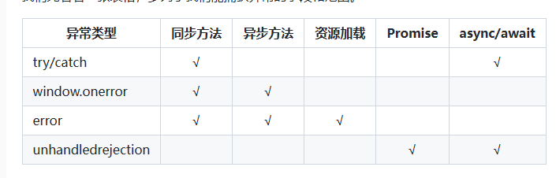
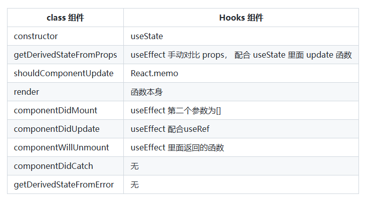

# 题目 33 - 题目 40

## 33. 实现 useUpdate 方法，调用时强制组件重新渲染

```js showLineNumbers title="测试代码"
import { useReducer } from 'react'

const updateReducer = (num: number): number => (num + 1) % 1_000_000

export default function useUpdate(): () => void {
  const [, update] = useReducer(updateReducer, 0)

  return update
}
```

## 34. react 中怎么捕获异常？

EerrorBoundary 是 16 版本出来的，之前的 15 版本有 unstable_handleError。

关于 ErrorBoundary 官网介绍比较详细，它能捕捉以下异常：

- 子组件的渲染
- 生命周期函数
- 构造函数

```js showLineNumbers title="测试代码"
class ErrorBoundary extends React.Component {
  constructor(props) {
    super(props)
    this.state = { hasError: false }
  }

  componentDidCatch(error, info) {
    // Display fallback UI
    this.setState({ hasError: true })
    // You can also log the error to an error reporting service
    logErrorToMyService(error, info)
  }

  render() {
    if (this.state.hasError) {
      // You can render any custom fallback UI
      return <h1>Something went wrong.</h1>
    }
    return this.props.children
  }
}

;<ErrorBoundary>
  <MyWidget />
</ErrorBoundary>
```

```js showLineNumbers title="react-error-boundary的使用"
import { ErrorBoundary } from 'react-error-boundary'

function ErrorFallback({ error, resetErrorBoundary }) {
  return (
    <div role="alert">
      <p>Something went wrong:</p>
      <pre>{error.message}</pre>
      <button onClick={resetErrorBoundary}>Try again</button>
    </div>
  )
}

const ui = (
  <ErrorBoundary
    FallbackComponent={ErrorFallback}
    onReset={() => {
      // reset the state of your app so the error doesn't happen again
    }}
  >
    <ComponentThatMayError />
  </ErrorBoundary>
)
```



## 35. 使用 redux 有哪些原则？

- 单一数据源：整个应用的全局 state 被存储在一棵 object tree 中，并且这个 object tree 只存在于唯一一个 store 中。
- State 是只读的：唯一改变 state 的方法就是触发 action，action 是一个用于描述已发生事情的普通对象。
- 使用纯函数来执行修改：为了描述 action 如何改变 state tree，你需要编写纯的 reducers。

## 36.使用 React hooks 怎么实现类里面的所有生命周期？



## 37.实现一个 useTimeout Hook

useTimeout 是可以在函数式组件中，处理 setTimeout 计时器函数

```js showLineNumbers title="测试代码"
function App() {
  const [state, setState] = useState(1)
  setTimeout(() => {
    setState(state + 1)
  }, 3000)
  return (
    // 我们原本的目的是在页面渲染完3s后修改一下state，但是你会发现当state+1后，触发了页面的重新渲染，就会重新有一个3s的定时器出现来给state+1，既而变成了每3秒+1。
    <div> {state} </div>
  )
}
```

```js showLineNumbers title="hooks的闭包缺陷"
function App() {
  const [count, setCount] = useState(0)
  const [countTimeout, setCountTimeout] = useState(0)
  useEffect(() => {
    setTimeout(() => {
      setCountTimeout(count)
    }, 3000)
    setCount(5)
  }, [])
  return (
    //count发生了变化，但是3s后setTimout的count却还是0
    <div>
      Count: {count}
      <br />
      setTimeout Count: {countTimeout}
    </div>
  )
}
```

```js showLineNumbers title="实现useTimeout"
function useTimeout(callback, delay) {
  const memorizeCallback = useRef()

  useEffect(() => {
    memorizeCallback.current = callback
  }, [callback])

  useEffect(() => {
    if (delay !== null) {
      const timer = setTimeout(() => {
        memorizeCallback.current()
      }, delay)
      return () => {
        clearTimeout(timer)
      }
    }
  }, [delay])
}
```

## 38.说说你对 React Hook 的闭包陷阱的理解，有哪些解决方案？

```js showLineNumbers title="结果均为1"
function App() {
  const [count, setCount] = useState(1)
  useEffect(() => {
    setInterval(() => {
      // 不管在这个组件中的其他地方使用 setCount 将 count 设置为任何值，还是设置多少次，打印的都是1
      console.log(count)
    }, 1000)
  }, [])
}
```

好，开动脑袋开始想象起来，组件第一次渲染执行 App()，执行 useState 设置了初始状态为 1，所以此时的 count 为 1。然后执行了 useEffect，回调函数执行，设置了一个定时器每隔 1s 打印一次 count。

接着想象如果 click 函数被触发了，调用 setCount(2) 肯定会触发 react 的更新，更新到当前组件的时候也是执行 App()，之前说的链表已经形成了哈，此时 useState 将 Hook 对象 上保存的状态置为 2， 那么此时 count 也为 2 了。然后在执行 useEffect 由于依赖数组是一个空的数组，所以此时回调并不会被执行。

ok，这次更新的过程中根本就没有涉及到这个定时器，这个定时器还在坚持的，默默的，每隔 1s 打印一次 count。 注意这里打印的 count ，是组件第一次渲染的时候 App() 时的 count， count 的值为 1，因为在定时器的回调函数里面被引用了，形成了闭包一直被保存。

### 为什么使用 useRef 能够每次拿到新鲜的值？

大白话说：因为初始化的 useRef 执行之后，返回的都是同一个对象。

```js showLineNumbers title="测试代码"
/* 将这些相关的变量写在函数外 以模拟react hooks对应的对象 */
let isC = false
let isInit = true // 模拟组件第一次加载
let ref = {
  current: null
}

function useEffect(cb) {
  // 这里用来模拟 useEffect 依赖为 [] 的时候只执行一次。
  if (isC) return
  isC = true
  cb()
}

function useRef(value) {
  // 组件是第一次加载的话设置值 否则直接返回对象
  if (isInit) {
    ref.current = value
    isInit = false
  }
  return ref
}

function App() {
  let ref_ = useRef(1)
  ref_.current++
  useEffect(() => {
    setInterval(() => {
      console.log(ref.current) // 3
    }, 2000)
  })
}

// 连续执行两次 第一次组件加载 第二次组件更新
App()
App()
```

```js showLineNumbers title="利用Object.assign解决"
function App() {
  // return <Demo1 />
  return <Demo2 />
}

function Demo2() {
  const [obj, setObj] = useState({ name: 'chechengyi' })

  useEffect(() => {
    setInterval(() => {
      console.log(obj)
    }, 2000)
  }, [])

  function handClick() {
    setObj(prevState => {
      var nowObj = Object.assign(prevState, {
        name: 'baobao',
        age: 24
      })
      console.log(nowObj == prevState)
      return nowObj
    })
  }
  return (
    <div>
      <div>
        <span>
          name: {obj.name} | age: {obj.age}
        </span>
        <div>
          <button onClick={handClick}>click!</button>
        </div>
      </div>
    </div>
  )
}
```

```js showLineNumbers title="上述代码运行结果"
{
    name: 'baobao',
    age: 24
}
```

## 39.说说你对 useReducer 的理解

1. useReducer 接受两个参数：

- reducer：一个纯函数，用于处理状态的更新。它接收当前状态和一个动作对象，然后返回一个新的状态。
- initialState：初始状态，可以是任意类型的值（数字、对象、数组等）。
- state：当前的状态值。
- dispatch：一个函数，用来分发动作，触发状态更新。

```js showLineNumbers title="测试代码"
const [state, dispatch] = useReducer(reducer, initialState)
```

2. reducer
   reducer 函数接收两个参数：

- state：当前的状态。
- action：包含了要更新状态的指令或者数据的对象。

reducer 函数根据 action 的不同类型，返回一个新的状态。

```js showLineNumbers title="测试代码"
function reducer(state, action) {
  switch (action.type) {
    case 'increment':
      return { count: state.count + 1 }
    case 'decrement':
      return { count: state.count - 1 }
    default:
      return state
  }
}
```

3. 如何使用 useReducer
   在使用 useReducer 时，你需要：

- 定义一个 reducer 函数来指定如何更新状态。
- 使用 useReducer 获取 state 和 dispatch。
- 使用 dispatch 来触发状态更新。

```js showLineNumbers title="测试代码"
import React, { useReducer } from 'react'

// 定义初始状态
const initialState = { count: 0 }

// 定义 reducer 函数
function reducer(state, action) {
  switch (action.type) {
    case 'increment':
      return { count: state.count + 1 }
    case 'decrement':
      return { count: state.count - 1 }
    default:
      return state
  }
}

function Counter() {
  const [state, dispatch] = useReducer(reducer, initialState)

  return (
    <div>
      <p>Count: {state.count}</p>
      <button onClick={() => dispatch({ type: 'increment' })}>Increment</button>
      <button onClick={() => dispatch({ type: 'decrement' })}>Decrement</button>
    </div>
  )
}

export default Counter
```

## 40.我们应该在什么场景下使用 useMemo 和 useCallback ？

1. 计算密集型操作 - useMemo:

- 当一个组件中存在一些复杂的计算,并且这些计算的结果会被多次使用时,可以使用 useMemo 缓存计算结果。
- 这样可以避免每次渲染时都重复执行这些昂贵的计算操作,提高组件的性能。

2. 依赖项变化时重新创建 - useCallback:

- 当一个组件需要传递函数给子组件时,如果该函数依赖于组件的 props 或 state,那么可以使用 useCallback 缓存该函数。

- 这样可以确保只有当依赖项发生变化时,函数才会被重新创建,避免不必要的重新渲染。

3. memo 和 shouldComponentUpdate 配合使用 - useMemo 和 useCallback:

- 将 useMemo 和 useCallback 与 React.memo 或 shouldComponentUpdate 结合使用,可以进一步优化组件的性能。

- 例如,对于子组件,可以使用 React.memo 进行 shallow comparison 比较,再配合 useMemo 和 useCallback 优化父组件。

4. 大量重复的渲染 - useMemo:

- 当一个组件会进行大量的重复渲染时,可以使用 useMemo 缓存一些中间计算结果,减轻 CPU 负担。

- 这样可以显著提高组件的整体性能。
