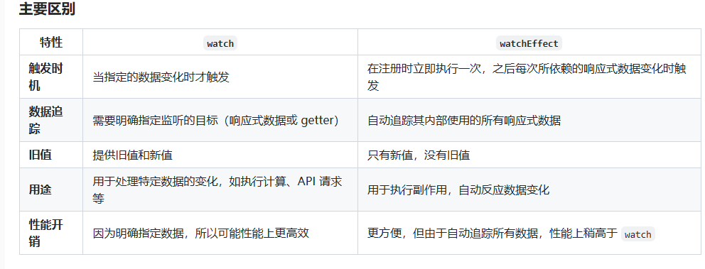

# 题目 1 - 题目 8

## 1.watch 与 watchEffect 有什么区别，分别在什么场景下使用？

watch 和 watchEffect 是 Vue 3 中用于响应式数据变化的两个 API，它们都可以用于监听和响应数据的变化，但有一些关键的区别。理解这两个 API 的不同用途和行为对于有效地使用 Vue 3 的响应式系统非常重要。

1. watch

- watch 是 Vue 3 中用于监听特定的响应式数据变化的 API。你可以选择一个或多个响应式源，并在其变化时执行相应的回调函数

```js showLineNumbers title="测试代码"
import { ref, watch } from 'vue'

const count = ref(0)

watch(count, (newVal, oldVal) => {
  console.log(`count changed from ${oldVal} to ${newVal}`)
})

// 修改 count 时触发 watch
count.value = 1
```

特点

- 监听指定的响应式数据：你需要明确指定要监听的目标，可以是一个响应式数据、多个响应式数据或 getter 函数。
- 手动触发回调：watch 只会在你指定的数据变化时触发回调函数，而不是自动运行。需要显式指定要监听的数据。
- 获取旧值：你可以通过 watch 获取到变化前的旧值。

```js showLineNumbers title="测试代码"
import { ref, watch } from 'vue'

const count = ref(0)
const message = ref('Hello')

watch([count, message], ([newCount, newMessage], [oldCount, oldMessage]) => {
  console.log(`count: ${oldCount} -> ${newCount}, message: ${oldMessage} -> ${newMessage}`)
})

count.value = 1
message.value = 'World'
```

2.  watchEffect

```js showLineNumbers title="测试代码"
import { ref, watchEffect } from 'vue'

const count = ref(0)

watchEffect(() => {
  console.log(`count is: ${count.value}`)
})

// 修改 count 时自动触发 watchEffect
count.value = 1
```

特点

- 自动追踪响应式数据：watchEffect 会自动追踪其作用域内的所有响应式数据（如 ref、reactive）的变化，不需要显式指定要监听的数据。
- 立即执行：watchEffect 在注册时会立即执行一次，且执行副作用时会跟踪其内部使用的响应式数据。
- 没有旧值：watchEffect 不会提供旧值，它只关心当前的变化和执行副作用。

```js showLineNumbers title="测试代码"
import { ref, watchEffect } from 'vue'

const count = ref(0)
const message = ref('Hello')

watchEffect(() => {
  console.log(`count is: ${count.value}, message is: ${message.value}`)
})

count.value = 1
message.value = 'World'
```



## 2.Pinia 有哪些应用场景

Pinia 的核心功能是管理全局状态，适用于以下场景：

1. 全局状态管理

- 跨组件共享数据：当多个组件需要共享同一份状态时（如用户信息、权限等）。
- 全局状态存储：如用户登录态、应用设置（语言、主题）、权限配置等。

```js showLineNumbers title="测试代码"
// store/user.js
import { defineStore } from 'pinia'

export const useUserStore = defineStore('user', {
  state: () => ({
    isLoggedIn: false,
    username: ''
  }),
  actions: {
    login(username) {
      this.isLoggedIn = true
      this.username = username
    },
    logout() {
      this.isLoggedIn = false
      this.username = ''
    }
  }
})
```

2. 在需要跨页面或跨会话保留某些数据时，Pinia 可以与持久化插件结合（如 pinia-plugin-persistedstate）实现状态持久化。

适用场景：

- 保留登录信息、用户配置、购物车数据等。
- 恢复应用的上一次操作状态。

```js showLineNumbers title="测试代码"
import { defineStore } from 'pinia'
import piniaPluginPersistedstate from 'pinia-plugin-persistedstate'

export const useSettingsStore = defineStore('settings', {
  state: () => ({
    theme: 'light'
  }),
  persist: true // 开启持久化
})
```

3. 模块化管理复杂项目

- 项目中存在多个功能模块（如用户、权限、订单、商品管理等），需要对状态进行模块化划分。
- 不同模块间需要数据共享或依赖。

```js showLineNumbers title="测试代码"
// stores/user.js
export const useUserStore = defineStore('user', {
  /* 用户模块 */
})
// stores/product.js
export const useProductStore = defineStore('product', {
  /* 商品模块 */
})
```

4. 异步数据管理

```js showLineNumbers title="测试代码"
import axios from 'axios'

export const useProductStore = defineStore('product', {
  state: () => ({
    products: []
  }),
  actions: {
    async fetchProducts() {
      const response = await axios.get('/api/products')
      this.products = response.data
    }
  }
})
```

5. Pinia 提供响应式的状态管理，能够让组件逻辑与数据状态分离，适用于以下场景：

```js showLineNumbers title="测试代码"
export const useCounterStore = defineStore('counter', {
  state: () => ({
    count: 0
  }),
  actions: {
    increment() {
      this.count++
    }
  }
})

// 在多个组件中使用：
const counterStore = useCounterStore()
counterStore.increment()
```

6. 适配 TypeScript 项目

```js showLineNumbers title="测试代码"
import { defineStore } from 'pinia';

interface State {
  count: number;
}

export const useCounterStore = defineStore<'counter', State>('counter', {
  state: () => ({
    count: 0,
  }),
  actions: {
    increment() {
      this.count++;
    },
  },
});
```

7. 动添创建 Store

```js showLineNumbers title="测试代码"
import { defineStore } from 'pinia'

export const createDynamicStore = id => {
  return defineStore(id, {
    state: () => ({
      data: null
    })
  })
}

const storeA = createDynamicStore('moduleA')
const storeB = createDynamicStore('moduleB')
```

## 3.说说你对 Vue 中异步组件的理解

在 Vue 中，异步组件是指那些在需要时才加载的组件，而不是在应用初始化时就立即加载。这种机制可以显著提升页面加载速度和用户体验，尤其是在大型单页应用（SPA）中，通过懒加载的方式按需加载组件，避免不必要的资源浪费。

使用方法：

- 使用 defineAsyncComponent

```js showLineNumbers title="测试代码"
import { defineAsyncComponent } from 'vue'

const AsyncComponent = defineAsyncComponent(() => import('./components/MyComponent.vue'))

export default {
  components: {
    AsyncComponent
  }
}
```

- 使用 import() 动态导入

```js showLineNumbers title="测试代码"
export default {
  components: {
    // 使用 dynamic import() 语法来实现异步加载
    AsyncComponent: () => import('./components/MyComponent.vue')
  }
}
```

### 加载过程：

1. 当 Vue 渲染页面时，如果遇到异步组件，Vue 会立即返回一个占位符（通常是一个空的组件或 loading 状态）。
2. Vue 会发起一个请求加载该组件，直到组件加载完成后，Vue 会用加载完成的组件替换占位符并渲染页面。

### 配合加载状态

为了提升用户体验，异步组件加载时可以显示一个加载状态（如加载动画）。Vue 提供了几个钩子来管理这些状态： <br />

- loading：组件正在加载时显示的内容。
- error：加载失败时显示的内容。
- delay：设置延迟显示加载状态的时间，避免瞬间加载显示加载状态。
- timeout：设置加载超时时间，超过时间仍未加载完成会显示错误。

```js showLineNumbers title="测试代码"
const AsyncComponent = defineAsyncComponent({
  loader: () => import('./components/MyComponent.vue'),
  loadingComponent: Loading, // 加载中的组件
  errorComponent: ErrorComponent, // 错误组件
  delay: 200, // 延迟 200ms 显示加载状态
  timeout: 3000 // 超过 3 秒显示错误组件
})
```

## 4. markRaw

在 Vue 3 中，markRaw 是一个用于标记对象的 API，主要用于优化性能和防止 Vue 的响应式系统对某些对象的处理。以下是对 markRaw 的详细理解： <br />

1. 功能

- 标记为非响应式：markRaw 可以将一个对象标记为非响应式对象。使用该 API 后，Vue 不会将这个对象转换为响应式对象，任何对其属性的修改都不会触发 Vue 的响应式系统。

2. 用法场景

- 性能优化：在某些情况下，某些对象（如大型库的实例、第三方插件等）不需要响应式特性，因为它们的属性变化不需要 Vue 进行监测。这时可以使用 markRaw 来优化性能。
- 避免不必要的代理：使用 markRaw 可以避免 Vue 对某些对象的代理开销，尤其是当这些对象不会被 Vue 观察或更新时。

```js showLineNumbers title="测试代码"
import { markRaw } from 'vue'

// 一个非响应式的对象
const nonReactiveObj = markRaw({ someProperty: 'value' })

// 使用这个对象
console.log(nonReactiveObj.someProperty) // 'value'

// 修改属性不会触发 Vue 的响应式系统
nonReactiveObj.someProperty = 'new value'
```

## 5.Vue 中的 h 函数有什么用

在 Vue 中，h 函数是一个用于创建虚拟 DOM 节点的工厂函数。它的全称是 createElement，在 Vue 3 中，它通常被直接引用为 h。 <br />

```js showLineNumbers title="测试代码"
h(tag, props, children)
```

```js showLineNumbers title="虚拟DOM示例"
import { defineComponent, h } from 'vue'

export default defineComponent({
  name: 'MyComponent',
  render() {
    return h('div', { class: 'my-class' }, [h('h1', 'Hello World'), h('p', 'This is a paragraph.')])
  }
})
```

```js showLineNumbers title="动态组件"
import { defineComponent, h, ref } from 'vue'

const MyButton = { template: '<button>Button</button>' }
const MyLink = { template: '<a href="#">Link</a>' }

export default defineComponent({
  name: 'DynamicComponent',
  setup() {
    const isButton = ref(true)

    return { isButton }
  },
  render() {
    const component = this.isButton ? MyButton : MyLink
    return h(component)
  }
})
```

```js showLineNumbers title="结合JSX"
/** @jsx h */
import { defineComponent } from 'vue'

export default defineComponent({
  name: 'MyComponent',
  render() {
    return (
      <div class="my-class">
        <h1>Hello World</h1>
        <p>This is a paragraph.</p>
      </div>
    )
  }
})
```

## 6.手动实现 vue 的双向绑定

1. 使用 Object.defineProperty() 实现 Vue 2 风格的双向绑定

   - 创建一个 Vue 实例。
   - 实现数据的响应式。
   - 创建一个简单的 watcher 用于更新 DOM。
   - 实现双向绑定。

```js showLineNumbers title="VUE2"
<!DOCTYPE html>
<html lang="en">
<head>
    <meta charset="UTF-8">
    <meta name="viewport" content="width=device-width, initial-scale=1.0">
    <title>Vue-like Two-way Binding</title>
</head>
<body>
    <div id="app">
        <input type="text" v-model="message">
        <p>{{ message }}</p>
    </div>

    <script>
        // 实现 Vue 实例
        class Vue {
            constructor(options) {
                this.data = options.data;
                this.el = document.querySelector(options.el);
                this.bindings = [];

                // 数据响应式
                this.observe(this.data);

                // 编译模板
                this.compile(this.el);
            }

            // 将数据转换为响应式
            observe(data) {
                Object.keys(data).forEach(key => {
                    let value = data[key];
                    const bindings = [];

                    Object.defineProperty(data, key, {
                        get() {
                            // 这里添加依赖
                            if (Dep.target) {
                                bindings.push(Dep.target);
                            }
                            return value;
                        },
                        set(newValue) {
                            value = newValue;
                            bindings.forEach(fn => fn());
                        }
                    });
                });
            }

            // 编译模板
            compile(el) {
                const nodes = el.childNodes;
                nodes.forEach(node => {
                    if (node.nodeType === 1) { // 处理元素节点
                        const attr = node.getAttribute('v-model');
                        if (attr) {
                            this.bindings.push({
                                node,
                                key: attr,
                                update: () => {
                                    node.value = this.data[attr];
                                }
                            });
                            node.addEventListener('input', e => {
                                this.data[attr] = e.target.value;
                            });
                        }
                    } else if (node.nodeType === 3) { // 处理文本节点
                        const text = node.textContent.trim();
                        const regExp = /\{\{\s*(\w+)\s*\}\}/;
                        const match = text.match(regExp);
                        if (match) {
                            const key = match[1];
                            this.bindings.push({
                                node,
                                key,
                                update: () => {
                                    node.textContent = this.data[key];
                                }
                            });
                        }
                    }
                });

                // 更新绑定
                this.updateBindings();
            }

            // 更新所有绑定
            updateBindings() {
                this.bindings.forEach(binding => binding.update());
            }
        }

        // 依赖管理
        class Dep {
            static target = null;
        }

        // 创建 Vue 实例
        new Vue({
            el: '#app',
            data: {
                message: 'Hello Vue!'
            }
        });
    </script>
</body>
</html>
```

2. 使用 Proxy 实现 Vue 3 风格的双向绑定

   - 创建一个 Vue 实例。
   - 实现数据的响应式使用 Proxy。
   - 实现双向绑定。

```js showLineNumbers title="VUE3"
<!DOCTYPE html>
<html lang="en">
<head>
    <meta charset="UTF-8">
    <meta name="viewport" content="width=device-width, initial-scale=1.0">
    <title>Vue-like Two-way Binding</title>
</head>
<body>
    <div id="app">
        <input type="text" data-bind="message">
        <p>{{ message }}</p>
    </div>

    <script>
        // 实现 Vue 实例
        function Vue(options) {
            this.data = options.data;
            this.el = document.querySelector(options.el);

            // 数据响应式
            this.proxyData(this.data);

            // 编译模板
            this.compile(this.el);
        }

        Vue.prototype.proxyData = function(data) {
            this._data = new Proxy(data, {
                get: (target, key) => {
                    // 返回数据值
                    return target[key];
                },
                set: (target, key, value) => {
                    // 更新数据
                    target[key] = value;
                    // 触发视图更新
                    this.update();
                    return true;
                }
            });
        };

        Vue.prototype.compile = function(el) {
            const nodes = el.childNodes;
            nodes.forEach(node => {
                if (node.nodeType === 1) { // 处理元素节点
                    const attr = node.getAttribute('data-bind');
                    if (attr) {
                        node.value = this._data[attr];
                        node.addEventListener('input', e => {
                            this._data[attr] = e.target.value;
                        });
                    }
                } else if (node.nodeType === 3) { // 处理文本节点
                    const text = node.textContent.trim();
                    const regExp = /\{\{\s*(\w+)\s*\}\}/;
                    const match = text.match(regExp);
                    if (match) {
                        const key = match[1];
                        node.textContent = this._data[key];
                    }
                }
            });
        };

        Vue.prototype.update = function() {
            const nodes = this.el.querySelectorAll('[data-bind]');
            nodes.forEach(node => {
                const key = node.getAttribute('data-bind');
                node.value = this._data[key];
            });

            const textNodes = this.el.querySelectorAll('p');
            textNodes.forEach(node => {
                const regExp = /\{\{\s*(\w+)\s*\}\}/;
                const text = node.textContent.trim();
                const match = text.match(regExp);
                if (match) {
                    const key = match[1];
                    node.textContent = this._data[key];
                }
            });
        };

        // 创建 Vue 实例
        new Vue({
            el: '#app',
            data: {
                message: 'Hello Vue!'
            }
        });
    </script>
</body>
</html>
```

## 7.Proxy 与 Object.defineProperty 的区别

1. Object.defineProperty <br />
   功能

- 用于定义或修改对象的属性，包括属性的值、可写性、可枚举性、可配置性等。
- 主要用于对单个属性进行细粒度的控制。
  使用场景
- 对象属性的拦截和修改，例如：
  - 定义 getter 和 setter。
  - 修改属性的配置。

```js showLineNumbers title="测试代码"
const obj = {}
Object.defineProperty(obj, 'name', {
  value: 'Alice',
  writable: true,
  enumerable: true,
  configurable: true
})

console.log(obj.name) // Alice

Object.defineProperty(obj, 'name', {
  get() {
    return 'Bob'
  }
})

console.log(obj.name) // Bob
```

限制

- 只对定义的属性有效，不能拦截对对象的整体访问或操作。
- 需要针对每个属性分别进行定义，无法一次性处理多个属性或整个对象。

2. Proxy <br />
   功能

- 用于创建一个代理对象，该对象可以拦截并自定义对目标对象的基本操作（如属性访问、赋值、删除等）。
- 提供了更多的拦截能力和灵活性，支持对整个对象的操作。

使用场景

- 可以用来拦截和修改对象的所有操作，例如：
  - 属性的读取、赋值、删除。
  - 函数调用。
  - 目标对象的创建和扩展。

```js showLineNumbers title="测试代码"
const target = {
  name: 'Alice'
}

const handler = {
  get(target, property) {
    return property in target ? target[property] : 'Default'
  },
  set(target, property, value) {
    target[property] = value.toUpperCase()
    return true
  }
}

const proxy = new Proxy(target, handler)

console.log(proxy.name) // Alice
proxy.name = 'Bob'
console.log(proxy.name) // BOB
console.log(proxy.age) // Default
```

## 8.Vue 中的双向绑定和单项绑定数据流原则是否冲突

在 Vue 中，双向绑定和单向数据流原则并不冲突，而是可以协同工作的。

双向绑定（Two-Way Data Binding） <br />

- 定义：允许视图（UI）和模型（数据）之间的双向同步。即，当数据变化时，视图自动更新；当视图中的数据（如用户输入）变化时，模型也会相应更新。 <br />
- 实现：Vue 使用 v-model 指令实现双向绑定，适用于表单输入元素，使得数据和视图之间能够同步更新。 <br />

单向数据流（One-Way Data Flow）

- 定义：数据从父组件流向子组件，数据流动方向是单向的。子组件不能直接修改父组件的数据，而是通过事件将数据变化通知给父组件，父组件再根据需要更新数据。
- 实现：Vue 组件的设计遵循单向数据流，数据通过 props 从父组件传递到子组件，子组件通过事件向父组件发送通知。 <br />

如何协调两者

1. 双向绑定 在表单控件中的使用（如 v-model）实际是 Vue 对单向数据流的封装。尽管 v-model 使得视图和数据双向绑定，但其本质上仍然遵循单向数据流原则：

   - 数据流动：数据流动从父组件传递到子组件，v-model 只是将数据和视图的同步简化。
   - 更新机制：当用户输入变化时，视图更新数据，数据的变化再传递回父组件，确保数据的统一管理和维护。

2. 实现细节：

   - 内部实现：v-model 在内部使用了事件监听（如 input 事件）和数据绑定（如 value 属性）来实现双向同步，但在组件设计层面，数据流动仍然是单向的。
