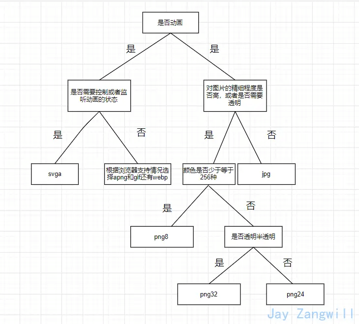

# 题目 26 - 题目 30

## 26.说说你对以下几个页面生命周期事件的理解：DOMContentLoaded，load，beforeunload，unload

- DOMContentLoaded —— 浏览器已完全加载 HTML，并构建了 DOM 树，但像 `` 和样式表之类的外部资源可能尚未加载完成。
- load —— 浏览器不仅加载完成了 HTML，还加载完成了所有外部资源：图片，样式等。
- beforeunload/unload —— 当用户正在离开页面时。

使用场景： <br />

- DOMContentLoaded 事件 —— DOM 已经就绪，因此处理程序可以查找 DOM 节点，并初始化接口。
- load 事件 —— 外部资源已加载完成，样式已被应用，图片大小也已知晓。
- beforeunload 事件 —— 用户正在离开：我们可以检查用户是否保存了更改，并询问他是否真的要离开。
- unload 事件 —— 用户几乎已经离开了，但是我们仍然可以启动一些操作，例如发送统计数据。

## 27.一台设备的 dpr，是否是可变的？

::: tip
dpr = 设备像素 / CSS 像素
:::

- 一个设备像素覆盖了多个 CSS 像素，dpr < 1，对应用户的缩小操作；
- 一个 CSS 像素覆盖了多个设备像素，dpr > 1，对应用户的放大操作。 <br />

由于用户的**缩放操作会改变 dpr**，所以设备 dpr 是在默认缩放为 100%的情况下定义的。

## 28.html 和 css 中的图片加载与渲染规则是什么样的？

- `、<picture>`和设置 background-image 的元素遇到 display:none 时，图片会加载，但不会渲染。
- `、<picture>`和设置 background-image 的元素祖先元素设置 display:none 时，background-image 不会渲染也不会加载，而 img 和 picture 引入的图片不会渲染但会加载
- `、<picture>`和 background-image 引入相同路径相同图片文件名时，图片只会加载一次
- 样式文件中 background-image 引入的图片，如果匹配不到 DOM 元素，图片不会加载
- 伪类引入的 background-image，比如:hover，只有当伪类被触发时，图片才会加载

## 29.meta 中的 viewport 是做什么用的，怎么写？

```html showLineNumbers title="测试代码"
<meta name="viewport" content="width=device-width, initial-scale=1.0" />
```

- width：控制 viewport 的大小，可以指定的一个值，如 600，或者特殊的值，如 device-width 为设备的宽度（单位为缩放为 100% 时的 CSS 的像素）。
- height：和 width 相对应，指定高度。
- initial-scale：初始缩放比例，也即是当页面第一次 load 的时候缩放比例。
- maximum-scale：允许用户缩放到的最大比例。
- minimum-scale：允许用户缩放到的最小比例。
- user-scalable：用户是否可以手动缩放。

## 30.图片的压缩类型

- 无损压缩：不会丢失图片质量，但是压缩率不高。

  - 在压缩图片的过程中，图片的质量没有任何损耗。我们任何时候都可以从无损压缩过的图片中恢复出原来的信息。

  - 压缩算法对图片的所有的数据进行编码压缩，能在保证图片的质量的同时降低图片的体积。例如 png、gif 使用的就是无损压缩。

- 有损压缩：会丢失图片质量，但是压缩率高。

  - 指在压缩文件大小的过程中，损失了一部分图片的信息，也即降低了图片的质量（即图片被压糊了），并且这种损失是不可逆的。

  - 常见的有损压缩手段是按照一定的算法将临近的像素点进行合并。压缩算法不会对图片所有的数据进行编码压缩，而是在压缩的时候，去除了人眼无法识别的图片细节。因此有损压缩可以在同等图片质量的情况下大幅降低图片的体积。例如 jpg 格式的图片使用的就是有损压缩。

- 无压缩： 图片不经过压缩，保持原始质量。
  - 无压缩的图片格式不对图片数据进行压缩处理，能准确地呈现原图片。例如 BMP 格式的图片。


