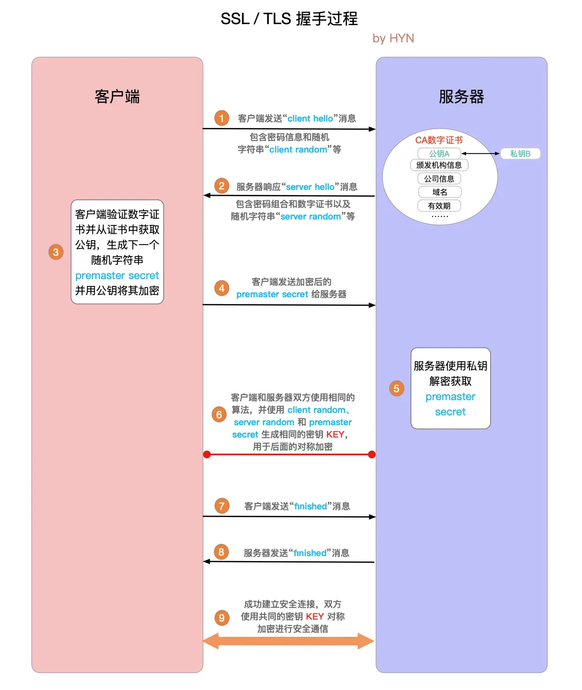

# 题目 6 - 题目 10

## 6.HTTPS 加密算法和加解密过程是啥？

SSL/TLS 握手过程

1. 客户端发起连接

- 客户端发送一个 “ClientHello” 消息，包含客户端支持的 TLS 版本、加密套件（加密算法组合）、压缩方法和其他信息。

2. 服务器响应

- 服务器回应一个 “ServerHello” 消息，选择客户端支持的加密套件和 TLS 版本。
- 服务器发送其数字证书给客户端。数字证书包含服务器的公钥，由证书颁发机构（CA）签名。

3. 证书验证

- 客户端验证服务器的数字证书的有效性和真实性。如果证书有效，客户端继续执行。
- 客户端生成一个随机的“pre-master secret”并用服务器的公钥加密，然后发送给服务器。这个“pre-master secret”将在后续的步骤中用于生成对称加密密钥。

4. 密钥交换

- 服务器使用其私钥解密“pre-master secret”并生成一个对称加密密钥（session key）。
- 客户端和服务器使用“pre-master secret”生成相同的对称加密密钥（session key），用于加密后续的通信数据。

5. 完成握手

- 双方用对称加密密钥加密并交换“Finished”消息，表示握手过程完成。
- 从这一点开始，客户端和服务器使用对称加密密钥加密和解密数据。



## 7.http3 中的 QUIC 是什么协议？

定义

- QUIC：QUIC 是一个基于 UDP 的传输层协议，旨在减少网络延迟和提高性能。最初由 Google 开发，现在已经成为 IETF 的标准化项目。
- 主要目标：提高传输效率，减少连接建立和数据传输的延迟，解决传统 TCP 和 HTTP/2 中的一些性能瓶颈。

特点

- 无连接的传输：QUIC 使用 UDP 进行数据传输，不同于 TCP 的面向连接特性。这使得 QUIC 可以更灵活地管理数据流和连接。
- 多路复用：类似于 HTTP/2，QUIC 支持多路复用，允许在一个连接上并发地传输多个数据流，从而避免队头阻塞。
- 内置加密：QUIC 集成了 TLS（传输层安全性），在数据传输时提供加密和安全性，消除了额外的握手过程。
- 0-RTT 数据传输：QUIC 支持 0-RTT 数据传输，使得在建立连接时可以立即开始数据传输，减少延迟。

## 8.说说你对 Server-sent events(SSE，服务端推送) 的了解

Server-Sent Events (SSE) 是一种基于 HTTP 的技术，用于实现服务器向客户端推送实时更新。与 WebSocket 不同，SSE 只支持从服务器到客户端的单向通信，并且是基于文本的事件流。

1. 单向通信：

- SSE 允许服务器主动向客户端推送消息，但客户端不能直接通过 SSE 向服务器发送数据（虽然可以通过其他方法，如普通的 HTTP 请求）。

2. 连接建立：

- 客户端通过向服务器发起 EventSource 请求来建立连接。服务器通过 HTTP 头 Content-Type: text/event-stream 声明响应内容类型，表明数据流是 SSE 格式。

```js showLineNumbers title="测试代码"
const eventSource = new EventSource('your-endpoint-url')

eventSource.onmessage = function (event) {
  console.log('New message:', event.data)
}

eventSource.onerror = function (error) {
  console.error('Error:', error)
}
```

3. 事件格式：

- SSE 数据格式简单，每条消息以 data: 开头，字段之间用空行分隔。事件类型、重试时间等信息可以通过特定字段传递。

data: Hello World
data: This is another line of data

4. 自动重连：

- 如果连接中断，浏览器会自动重连。服务器也可以通过 retry: 指令指定重连间隔。

retry: 5000

5. 事件类型：

可以指定事件类型，客户端通过 addEventListener 监听特定事件类型的消息。

```js showLineNumbers title="测试代码"
eventSource.addEventListener('custom-event', function (event) {
  console.log('Custom event:', event.data)
})
```

## 9.TCP/IP 是如何保证数据包传输有序可靠的？

1. 数据包传输有序
   TCP 确保数据包的顺序是通过以下机制实现的：

序列号（Sequence Number）：

- 每个 TCP 数据包（即 TCP 段）都有一个序列号，用于标识数据流中的位置。发送方会为每个数据包分配一个唯一的序列号。
- 接收方根据序列号重新排序接收到的数据包，确保数据的正确顺序。

确认应答（Acknowledgments）：

- 接收方在接收到数据包后，会发送一个确认应答（ACK）回到发送方，表明数据包已成功接收，并指明期望接收的下一个数据包的序列号。
- 发送方通过这些确认应答知道哪些数据包已被接收，哪些数据包可能需要重新发送。 2. 数据包传输可靠

2. TCP 通过以下机制实现数据传输的可靠性：

   1. 重传机制（Retransmission）：

      - 如果发送方在一定时间内未收到接收方的确认应答（ACK），发送方会重发数据包。这种情况可能发生在网络拥堵或数据包丢失时。

   2. 流量控制（Flow Control）：

      - TCP 使用流量控制机制来防止发送方发送过多的数据，导致接收方缓冲区溢出。接收方会告知发送方其接收能力（即接收窗口的大小），发送方依据此窗口大小调整数据发送速率。

   3. 拥塞控制（Congestion Control）：

      - TCP 通过拥塞控制机制来避免网络拥堵。它使用多种算法（如慢启动、拥塞避免、快速重传和快速恢复）来动态调整数据发送速率。

   4. 数据包完整性检查（Checksum）：

      - 每个 TCP 数据包都包含一个校验和字段，用于检测数据在传输过程中是否发生了损坏。接收方会计算数据包的校验和，并与数据包中的校验和进行比较。如果校验和不匹配，数据包会被丢弃，并请求重传。 3. 数据流控制

3. 数据流控制

滑动窗口（Sliding Window）：

- TCP 使用滑动窗口协议来控制数据的流动。窗口大小是接收方告知发送方的缓冲区大小，控制了发送方可以发送的数据量。
- 接收方通过调整窗口大小，动态调整数据的接收能力，从而避免数据丢失或缓冲区溢出。

4. 排序和合并

   1. 数据缓存和排序：

      - 接收方在接收到数据包后，会将数据包存储在缓存中，并根据序列号将数据包按正确顺序重新组装成完整的数据流。

   2. 数据合并：

      - 接收方将接收到的分段数据包按照序列号进行合并，确保应用层接收到的是完整的、按正确顺序的数据

## 10.HTTP Header 中有哪些信息？

请求头（Request Headers）

- Accept：指定客户端能够接受的内容类型。例如：Accept: application/json, text/html.
- Accept-Encoding：指定客户端能够接受的编码格式。例如：Accept-Encoding: gzip, deflate.
- Accept-Language：指定客户端能够接受的语言。例如：Accept-Language: en-US, en;q=0.9.
- Authorization：用于身份验证的头部。例如：Authorization: Bearer `<token>`.
- Cookie：发送给服务器的 cookie 信息。例如：Cookie: sessionId=abc123.
- Host：指定请求的目标主机和端口。例如：Host: www.example.com.
- User-Agent：标识发出请求的用户代理（通常是浏览器）。例如：User-Agent: Mozilla/5.0 (Windows NT 10.0; Win64; x64) AppleWebKit/537.36 (KHTML, like Gecko) Chrome/91.0.4472.124 Safari/537.36.

响应头（Response Headers）

- ontent-Type：响应体的内容类型。例如：Content-Type: text/html; charset=UTF-8.
- ontent-Length：响应体的长度（字节数）。例如：Content-Length: 1234.
- ate：响应被发送的日期和时间。例如：Date: Mon, 16 Aug 2024 12:00:00 GMT.
- erver：服务器的软件信息。例如：Server: Apache/2.4.41 (Ubuntu).
- et-Cookie：用于在客户端设置 cookie。例如：Set-Cookie: sessionId=abc123; Path=/; HttpOnly.
- ache-Control：指定缓存策略。例如：Cache-Control: no-cache, no-store, must-revalidate.

通用头（General Headers）

- Connection：指定是否保持连接或关闭连接。例如：Connection: keep-alive.
- Upgrade：用于升级协议。例如：Upgrade: websocket.
- Via：标识请求/响应经过的中间代理。例如：Via: 1.1 example.com**.**

其他头部信息

- Location：在重定向响应中，指定重定向的目标 URL。例如：Location: https://www.example.com/new-page.
- ETag：资源的标识符，用于缓存控制。例如：ETag: "12345".
- If-Modified-Since：请求中指定的时间，服务器只在资源在此时间之后被修改时才返回资源。例如：If-Modified-Since: Mon, 16 Aug 2024 10:00:00 GMT.
