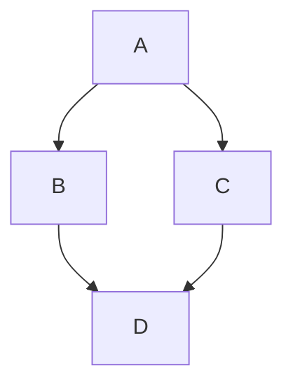

Content

## 测试

```cpp
#include <iostream>
int main()
{
   std::cout << "Hello World!" << std::endl;
   return 0;
}
```

:::tip
这是一个提示
:::

:::info
这是一个提示
:::

:::warning
这是一个提示
:::

:::danger
这是一个提示
:::

:::note[关键点]

这是一个提示
dsdsadsad
dasdsadas
dasdsad
**dsdsd**

dadasdasdasdsadada

:::

:::::info[Parent]

Parent content

::::danger[Child]

Child content

:::tip[Deep Child]

Deep child content

:::

::::

:::::

```js showLineNumbers title="测试代码"
console.log('每个仓库都应该有个吉祥物。')
```

```js showLineNumbers
function HighlightSomeText(highlight) {
  if (highlight) {
    // highlight-next-line
    return '这行被高亮了！'
  }

  return '这里不会'
}

function HighlightMoreText(highlight) {
  // highlight-start
  if (highlight) {
    return '这块被高亮了！'
  }
  // highlight-end

  return '这里不会'
}
```

```jsx live title="Clock"
function Clock(props) {
  const [date, setDate] = useState(new Date())
  useEffect(() => {
    const timerID = setInterval(() => tick(), 1000)

    return function cleanup() {
      clearInterval(timerID)
    }
  })

  function tick() {
    setDate(new Date())
  }

  return (
    <div>
      <h2>It is {date.toLocaleTimeString()}.</h2>
    </div>
  )
}
```

<details>
  <summary>Toggle me!</summary>

This is the detailed content

```js
console.log('Markdown features including the code block are available')
```

You can use Markdown here including **bold** and _italic_ text, and [inline link](https://docusaurus.io)

  <details>
    <summary>Nested toggle! Some surprise inside...</summary>

    😲😲😲😲😲

  </details>
</details>

$$
I = \int_0^{2\pi} \sin(x)\,dx
$$



# dsa

## dsds

### dadsda

#### dasdsa

##### dsa

dads
